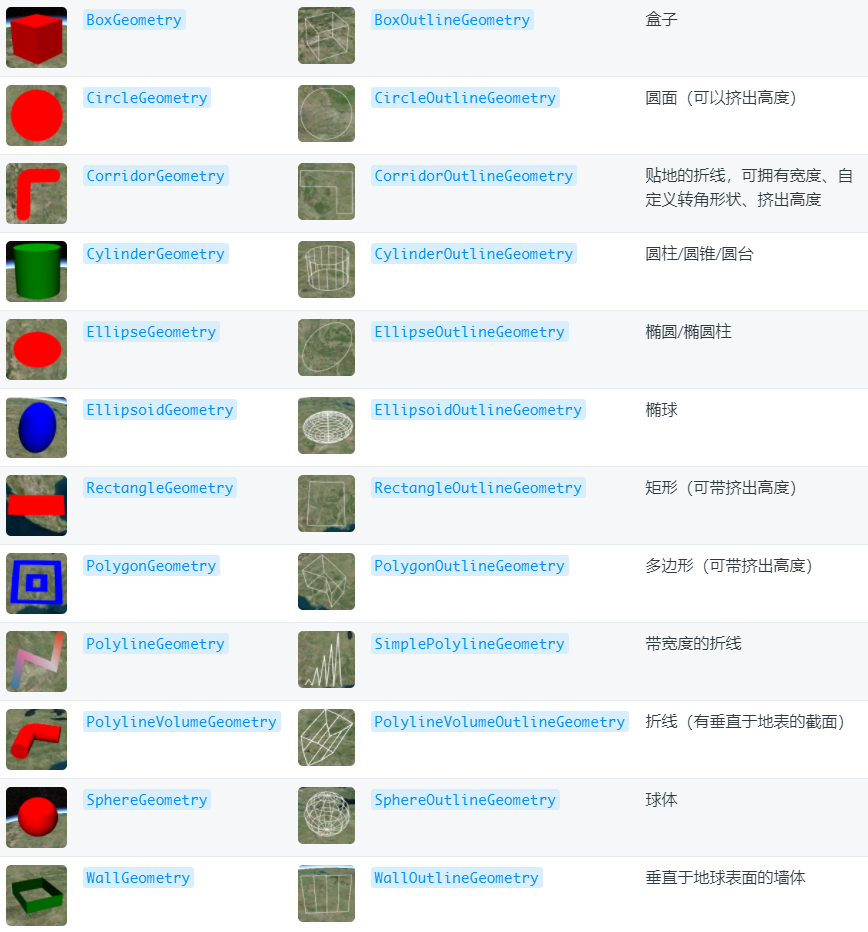

# Primitive

Primitive 是由 Geometry 和 Appearance 组合来构造几何图形的，想对于 Entity 实体，它具有以下优势：

- 性能高：当需要绘制大量静态图形时，使用 Primitive 可以将图形组合成一个大图形，从而减少 CPU 的开销；
- 更灵活：Primitive 可以随意组合图形，以达到目的；
- 更底层：Appearance 提供了接近底层的编程风格，可以轻松的顶点、片源着色器、自定义渲染等；


Primitive 支持的几何类：



## 点

Primitive 可以使用 [PointPrimitive](https://cesium.com/learn/cesiumjs/ref-doc/PointPrimitive.html) 和 [PointPrimitiveCollection](https://cesium.com/learn/cesiumjs/ref-doc/PointPrimitiveCollection.html#PointPrimitiveCollection) 两个 API 组合创建点要素。

- 方式一

  ```js
  // 使用 PointPrimitive 创建点
  const point = new Cesium.PointPrimitive();
  point.show = true;
  point.id = "point1";
  point.color = new Cesium.Color(1.0, 1.0, 1.0, 0.5);
  point.position = Cesium.Cartesian3.fromDegrees(102, 38, 0);
  point.pixelSize = 20;
  point.outlineColor = Cesium.Color.RED;
  point.outlineWidth = 1;
  
  // 创建 PointPrimitiveCollection 点集合，并将点添加到集合中
  const pointPrimitives = new Cesium.PointPrimitiveCollection();
  pointPrimitives.add(point);	// 可以 add 多次，添加多个点
  viewer.scene.primitives.add(pointPrimitives);
  ```

- 方式二

  ```js
  const points = viewer.scene.primitives.add(
      // 创建PointPrimitiveCollection，返回点集合对象
      new Cesium.PointPrimitiveCollection()
  );
  
  // add 可以调用多次，向点集合添加多个点
  const p = points.add({
      id: "point",
      show: true,
      position: Cesium.Cartesian3.fromDegrees(102, 38.5, 0),
      // 点的像素大小
      pixelSize: 20, 
      color: new Cesium.Color(1.0, 1.0, 1.0, 0.5),
      outlineWidth: 1,
      // 按相机视角的距离设置近缩放或远缩放
      scaleByDistance: new Cesium.NearFarScalar(1.5e2, 15, 8.0e6, 0.0) 
  });
  p.outlineColor = Cesium.Color.RED;
  ```

  

## 线

- 使用 [SimplePolylineGeometry](https://cesium.com/learn/cesiumjs/ref-doc/SimplePolylineGeometry.html) 创建线要素：

  ```js
  const polyline = new Cesium.GeometryInstance({
      id: "polylineInstance",
      geometry: new Cesium.SimplePolylineGeometry({
          positions: Cesium.Cartesian3.fromDegreesArray([
              99.83021344164428, 33.53064699203965, 113.79735610936098,
              40.18256338933031
          ])
          // colors: [Cesium.Color.GREEN] // 这里也可以控制线的颜色,和属性中配置二选一即可
      }),
      attributes: {
          color: Cesium.ColorGeometryInstanceAttribute.fromColor(
              new Cesium.Color(64, 1, 1, 1.0)
          ),
          // 控制是否显示
          show: new Cesium.ShowGeometryInstanceAttribute(true)
      }
  });
  
  viewer.scene.primitives.add(
      new Cesium.Primitive({
          geometryInstances: polyline,
          appearance: new Cesium.PerInstanceColorAppearance({
              flat: true // 着色器使用平面着色，不考虑光照
          })
      })
  );
  ```

- 使用 [GroundPolylineGeometry](https://cesium.com/learn/cesiumjs/ref-doc/GroundPolylineGeometry.html?classFilter=Polyline) 和 [GroundPolylinePrimitive](https://cesium.com/learn/cesiumjs/ref-doc/GroundPolylinePrimitive.html?classFilter=GroundPolylinePrimitive#GroundPolylinePrimitive) 创建线要素：

  ```js {22,26}
  const instance = new Cesium.GeometryInstance({
      id: "polyline",
      geometry: new Cesium.GroundPolylineGeometry({
          positions: Cesium.Cartesian3.fromDegreesArray([
              99.83021344164428, 33.53064699203965, 113.79735610936098,
              40.18256338933031
          ]),
          width: 4
      }),
      attributes: {
          color: Cesium.ColorGeometryInstanceAttribute.fromColor(
              Cesium.Color.fromCssColorString("green").withAlpha(0.7)
          ),
          show: new Cesium.ShowGeometryInstanceAttribute(true)
      }
  });
  
  viewer.scene.groundPrimitives.add(
      new Cesium.GroundPolylinePrimitive({
          geometryInstances: instance,
          // 为线设置材质
          appearance: new Cesium.PolylineMaterialAppearance({
              material: Cesium.Material.fromType("Checkerboard")
          }),
          // 为线设置颜色, 搭配上面的 attributes
          appearance: new Cesium.PolylineColorAppearance()
      })
  );
  ```

- 使用 [PolylineGeometry](https://cesium.com/learn/cesiumjs/ref-doc/PolylineGeometry.html?classFilter=PolylineGeometry) 创建线要素：

  ```js
  const geometryInstance = new Cesium.GeometryInstance({
      geometry: new Cesium.PolylineGeometry({
          positions: Cesium.Cartesian3.fromDegreesArray([
              99.83021344164428, 33.53064699203965, 113.79735610936098,
              40.18256338933031
          ]),
          width: 5
          // colors: [Cesium.Color.GREEN] // 和下面颜色属性二选一即可
      }),
      attributes: {
          color: Cesium.ColorGeometryInstanceAttribute.fromColor(
              Cesium.Color.fromCssColorString("green").withAlpha(0.7)
          )
      }
  });
  
  viewer.scene.primitives.add(
      new Cesium.Primitive({
          geometryInstances: geometryInstance,
          appearance: new Cesium.PolylineColorAppearance({
              translucent: false
          })
      })
  );
  ```

  

## 多边形

先创建一个[多边形](https://cesium.com/learn/cesiumjs/ref-doc/PolygonGeometry.html)，然后再使用 [Primitive](https://cesium.com/learn/cesiumjs/ref-doc/Primitive.html?classFilter=Primitive) 进行加载。

```js
const instance = new Cesium.GeometryInstance({
  id: "polygon",
  geometry: new Cesium.PolygonGeometry({
    polygonHierarchy: new Cesium.PolygonHierarchy(
      // 多边形的点可以不用闭合
      Cesium.Cartesian3.fromDegreesArray([
        105.68605750741426, 34.75288383565426, 108.29624998881121,
        31.81290436762565, 111.03516081164923, 34.710256022229814
      ])
    ),
    // 拉伸为柱体
    extrudedHeight: 300000
  })
});

viewer.scene.primitives.add(
  new Cesium.Primitive({
    geometryInstances: [instance],
    appearance: new Cesium.EllipsoidSurfaceAppearance({
      material: Cesium.Material.fromType("Color", {
        color: Cesium.Color.AQUA
      })
    }),
    vertexCacheOptimize: true,
    interleave: true
  })
);
```


## 矩形

先创建一个[矩形](https://cesium.com/learn/cesiumjs/ref-doc/RectangleGeometry.html)，然后再通过 [Primitive](https://cesium.com/learn/cesiumjs/ref-doc/Primitive.html?classFilter=Primitive) 进行添加。

```js
const instance = new Cesium.GeometryInstance({
  id: "polygon",
  geometry: new Cesium.RectangleGeometry({
    // 矩形所在的椭球体
    ellipsoid: Cesium.Ellipsoid.WGS84,
    // 左下角和右上角
    rectangle: Cesium.Rectangle.fromDegrees(
      97.60600216295973,
      30.63225182117263,
      104.08431420428155,
      33.91239781994055
    ),
    height: 0, 							// 距离地面的高度(单位:米)
    extrudedHeight: 500000, 			// 矩形的拉伸高度(单位:米)
    rotation: Cesium.Math.toRadians(90) // 旋转角度(弧度)
  })
});

viewer.scene.primitives.add(
  new Cesium.Primitive({
    geometryInstances: [instance],
    appearance: new Cesium.EllipsoidSurfaceAppearance({
      material: Cesium.Material.fromType("Color", {
        color: Cesium.Color.AQUA
      })
    }),
    vertexCacheOptimize: true,
    interleave: true
  })
);
```


## 椭圆

先创建一个[椭圆]([EllipseGeometry - Cesium 文档](https://cesium.com/learn/cesiumjs/ref-doc/EllipseGeometry.html))，然后再通过 [Primitive](https://cesium.com/learn/cesiumjs/ref-doc/Primitive.html?classFilter=Primitive) 进行添加。

```js
const instance = new Cesium.GeometryInstance({
  id: "polygon",
  geometry: new Cesium.EllipseGeometry({
    ellipsoid: Cesium.Ellipsoid.WGS84, 			// 椭圆位于椭圆体上
    center: Cesium.Cartesian3.fromDegrees(
      97.60600216295973,
      30.63225182117263
    ),
    semiMajorAxis: 500000.0,
    semiMinorAxis: 300000.0,
    rotation: Cesium.Math.toRadians(60.0),
    vertexFormat: Cesium.VertexFormat.DEFAULT, 	// 顶点格式
    height: 0,
    extrudedHeight: 500000
  })
});

viewer.scene.primitives.add(
  new Cesium.Primitive({
    geometryInstances: [instance],
    appearance: new Cesium.EllipsoidSurfaceAppearance({
      material: Cesium.Material.fromType("Color", {
        color: Cesium.Color.AQUA
      })
    }),
    vertexCacheOptimize: true,
    interleave: true
  })
);
```


## 圆

先创建一个[圆](https://cesium.com/learn/cesiumjs/ref-doc/CircleGeometry.html)，然后再通过 [Primitive](https://cesium.com/learn/cesiumjs/ref-doc/Primitive.html?classFilter=Primitive) 进行添加，当然也可以使用椭圆加载，把椭圆的长半轴和短半轴设置为相同值。

```js
const instance = new Cesium.GeometryInstance({
  id: "polygon",
  geometry: new Cesium.CircleGeometry({
    ellipsoid: Cesium.Ellipsoid.WGS84,
    center: Cesium.Cartesian3.fromDegrees(
      97.60600216295973,
      30.63225182117263
    ),
    radius: 500000,
    height: 0,
    extrudedHeight: 0, 	// 拉升为柱体
    granularity: 0.02,
    vertexFormat: Cesium.VertexFormat.DEFAULT
  })
});

viewer.scene.primitives.add(
  new Cesium.Primitive({
    geometryInstances: [instance],
    appearance: new Cesium.EllipsoidSurfaceAppearance({
      material: Cesium.Material.fromType("Color", {
        color: Cesium.Color.AQUA
      })
    }),
    vertexCacheOptimize: true,
    interleave: true
  })
);
```


## 圆柱（圆锥）

使用 [CylinderGeometry](https://cesium.com/learn/cesiumjs/ref-doc/CylinderGeometry.html) 创建圆柱，再通过 Primitive 添加到地图中。 

```js
const instance = new Cesium.GeometryInstance({
  id: "cylinder",
  geometry: new Cesium.CylinderGeometry({
    length: 100000,
    topRadius: 80000,
    bottomRadius: 80000,
    slices: 128
  }),
  modelMatrix: Cesium.Matrix4.fromTranslation(
    Cesium.Cartesian3.fromDegrees(-70, 40, 0)
  )
});

viewer.scene.primitives.add(
  new Cesium.Primitive({
    geometryInstances: [instance],
    appearance: new Cesium.EllipsoidSurfaceAppearance({
      material: Cesium.Material.fromType("Color", {
        color: Cesium.Color.RED
      })
    }),
    vertexCacheOptimize: true,
    interleave: true
  })
);
```


## 墙面

使用 [WallGeometry](https://cesium.com/learn/cesiumjs/ref-doc/WallGeometry.html) 创建墙面，再通过 Primitive 添加到地图中。

```js
const instance = new Cesium.GeometryInstance({
  id: "wall",
  geometry: new Cesium.WallGeometry({
    positions: Cesium.Cartesian3.fromDegreesArrayHeights([
      19.0, 47.0, 10000.0, 19.0, 48.0, 10000.0, 20.0, 48.0, 10000.0, 20.0,
      47.0, 10000.0, 19.0, 47.0, 10000.0
    ])
  })
});

viewer.scene.primitives.add(
  new Cesium.Primitive({
    geometryInstances: [instance],
    appearance: new Cesium.EllipsoidSurfaceAppearance({
      material: Cesium.Material.fromType("Color", {
        color: Cesium.Color.RED
      })
    }),
    vertexCacheOptimize: true,
    interleave: true
  })
);
```


## 连廊

使用 [CorridorGeometry](https://cesium.com/learn/cesiumjs/ref-doc/CorridorGeometry.html) 创建连廊，再通过 Primitive 添加到地图中，[示例图形详见](https://img-blog.csdnimg.cn/direct/f1c2774764a14dd2898cbb889cbb068e.png)。

```js
const instance = new Cesium.GeometryInstance({
  id: "corridor",
  geometry: new Cesium.CorridorGeometry({
    vertexFormat: Cesium.VertexFormat.POSITION_ONLY,
    positions: Cesium.Cartesian3.fromDegreesArray([
      -72.0, 40.0, -70.0, 35.0, -68.0, 38.0
    ]),
    width: 100000,
    height: 100000,
    extrudedHeight: 50000
  }),
  attributes: {
    color: Cesium.ColorGeometryInstanceAttribute.fromColor(Cesium.Color.AQUA)
  }
});

viewer.scene.primitives.add(
  new Cesium.Primitive({
    geometryInstances: [instance],
    appearance: new Cesium.PerInstanceColorAppearance({
      flat: true,
      translucent: false
    }),
    vertexCacheOptimize: true,
    interleave: true
  })
);
```


## 沙盒

使用 [BoxGeometry](https://cesium.com/learn/cesiumjs/ref-doc/BoxGeometry.html?classFilter=BoxGeometry) 创建盒子（类似于正方形），再通过 Primitive 添加到地图中。

```js
const instance = new Cesium.GeometryInstance({
  id: "box",
  geometry: new Cesium.BoxGeometry({
    vertexFormat: Cesium.VertexFormat.POSITION_ONLY,
    maximum: new Cesium.Cartesian3(25000, 25000, 25000),
    minimum: new Cesium.Cartesian3(-25000, -25000, -25000)
  }),
  attributes: {
    color: Cesium.ColorGeometryInstanceAttribute.fromColor(
      Cesium.Color.fromCssColorString("green").withAlpha(0.7)
    )
  },
  modelMatrix: Cesium.Transforms.eastNorthUpToFixedFrame(
    Cesium.Cartesian3.fromDegrees(-75, 40, 0)
  )
});

viewer.scene.primitives.add(
  new Cesium.Primitive({
    geometryInstances: [instance],
    appearance: new Cesium.PerInstanceColorAppearance({
      flat: true,
      translucent: false
    })
  })
);
```


## 球体

使用 [SphereGeometry](https://cesium.com/learn/cesiumjs/ref-doc/SphereGeometry.html?classFilter=SphereGeometry) 创建球体，再通过 Primitive 添加到地图中。

```js
const instance = new Cesium.GeometryInstance({
  id: "sphere",
  geometry: new Cesium.SphereGeometry({
    radius: 100,
    vertexFormat: Cesium.VertexFormat.POSITION_ONLY
  }),
  attributes: {
    color: Cesium.ColorGeometryInstanceAttribute.fromColor(Cesium.Color.RED)
  },
  modelMatrix: Cesium.Transforms.eastNorthUpToFixedFrame(
    Cesium.Cartesian3.fromDegrees(-75, 40, 1000)
  )
});

viewer.scene.primitives.add(
  new Cesium.Primitive({
    geometryInstances: [instance],
    appearance: new Cesium.PerInstanceColorAppearance({
      flat: true,
      translucent: false
    })
  })
);
```


## 椭球体

使用 [EllipsoidGeometry](https://cesium.com/learn/cesiumjs/ref-doc/EllipsoidGeometry.html?classFilter=EllipsoidGeometry) 创建椭球体，再通过 Primitive 添加到地图中。

```js
const instance = new Cesium.GeometryInstance({
  id: "sphere",
  geometry: new Cesium.EllipsoidGeometry({
    vertexFormat: Cesium.VertexFormat.POSITION_ONLY,
    radii: new Cesium.Cartesian3(10000, 5000, 5000)
  }),
  attributes: {
    color: Cesium.ColorGeometryInstanceAttribute.fromColor(Cesium.Color.RED)
  },
  modelMatrix: Cesium.Transforms.eastNorthUpToFixedFrame(
    Cesium.Cartesian3.fromDegrees(-75, 40, 1000)
  )
});

viewer.scene.primitives.add(
  new Cesium.Primitive({
    geometryInstances: [instance],
    appearance: new Cesium.PerInstanceColorAppearance({
      flat: true,
      translucent: false
    })
  })
);
```


