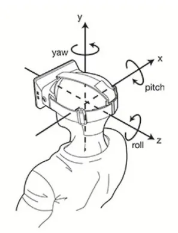

# 相机视角

在 cesium 中，我们要想确定相机视角，需要 设置相机的**位置（destination）**和**方向（orientation）**。

其中 orientation 方向是用来控制相机的 `heading`（偏航角）、`pitch`（俯仰角）、`roll`（翻滚角），地图中默认参数为 `[0, -90, 0]`。



cesium 提供了三个方法，可以执行相机的飞行视角：

|   方法    | 描述                                           | 是否有动画 |
| :-------: | :--------------------------------------------- | :--------: |
| `setView` | 视角跳转到指定位置点                           |     无     |
|  `flyTo`  | 可带有动画的切换视角到位置点                   |     有     |
| `lookAt`  | 视角跳转到指定位置点，视角可以旋转，但不能拖动 |     无     |
| `zoomTo`  | 视角跳转到给定的 数据源 的位置                 |     无     |


## setView

设置相机的位置、方向和变换，[查看 API](http://cesium.xin/cesium/cn/Documentation1.62/Camera.html?classFilter=camera#setView)。

```js
// 目标点的笛卡尔坐标
const position = Cesium.Cartesian3.fromDegrees(102.7362, 38.0249, 500);

// 定义相机的飞行目的地，直接跳转，没有飞行动画
viewer.camera.setView({
    destination: position,
    orientation: {
        heading: Cesium.Math.toRadians(0),
        pitch: Cesium.Math.toRadians(-90),
        roll: Cesium.Math.toRadians(0)
    }
});
```


## flyTo

将相机从当前位置移动到新位置，[查看 API](http://cesium.xin/cesium/cn/Documentation1.62/Camera.html?classFilter=camera#flyTo)。

```js {12}
// 目标点的笛卡尔坐标
const position = Cesium.Cartesian3.fromDegrees(102.7362, 38.0249, 500);

// 带有动画，持续时间 5 秒
viewer.camera.flyTo({
    destination: position,
    orientation: {
        heading: Cesium.Math.toRadians(0),
        pitch: Cesium.Math.toRadians(-90),
        roll: Cesium.Math.toRadians(0)
    },
    duration: 5
});
```


## lookAt

使用目标和偏移量设置摄像机的位置和方向，[查看 API](http://cesium.xin/cesium/cn/Documentation1.62/Camera.html?classFilter=camera#lookAt)。

```js
// 目标点的笛卡尔坐标
const position = Cesium.Cartesian3.fromDegrees(102.7362, 38.0249, 500); 

// lookAt 是将视角固定在设置的点上，可以旋转，但不能拖动位置
viewer.camera.lookAt(
    position,
    new Cesium.HeadingPitchRange(Cesium.Math.toRadians(0), Cesium.Math.toRadians(-90), 500) // 高度为 500
);
```


## zoomTo

异步设置摄像机以查看提供的一个或多个实体或数据源，[查看 API](http://cesium.xin/cesium/cn/Documentation1.62/Viewer.html?classFilter=viewer#zoomTo)。如果数据源仍在加载过程中，或者可视化仍在加载中，此方法在执行缩放之前等待数据准备就绪。

```js
const point = viewer.entities.add({
    id: "point",
    position: position,
    point: {
        color: Cesium.Color.RED,
        pixelSize: 20
    }
});

// 使用 zoomTo 需提供一个实体数据源
viewer.zoomTo(point, {
    heading: Cesium.Math.toRadians(0),
    pitch: Cesium.Math.toRadians(-90),
    range: 500 // 距离中心点的高度
});
```
