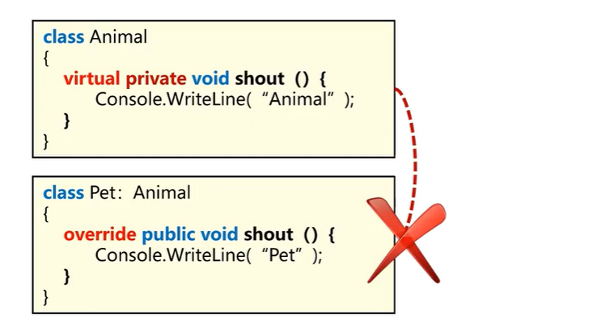

# class 类

## 基础使用

类的定义是以关键字 **class** 开始，后跟类的名称。类的主体，包含在一对花括号内。

```C#
class Monster
{
  public int height = 200;
  public string name = "王一博";

  public void Shout()
  {
    Console.WriteLine("我叫" + name);
  }

  public void Sing()
  {
    Console.WriteLine("我会唱跳篮球");
  }
}
```

实例化类：

```C#
Monster monster = new Monster();
monster.height = 500;
monster.name = "陈伟霆";

// 获取参数
Console.WriteLine(monster.height);
Console.WriteLine(monster.name);
// 调用方法
monster.Shout();
monster.Sing();
```


### this 指向

在 class 内部，this 指向的就是 **类本身**。

```C#
class Student
{
  public string name = "";
  public int age = 0;

  public void introduce(string name)
  {
    Console.WriteLine(this.name + "年龄是" + this.age);
  }
}

Student s = new Student();
s.name = "王一博";
s.age = 25;

s.introduce("陈伟霆"); // 王一博年龄是25
```


### 对象访问权限

权限：用于规定类内部的 属性/方法，能够被特定区域访问的规则。

::: tip

权限修饰符：

- **private**：只允许类内方法访问、修改；

- **protected**：只允许此类和派生类可访问、修改；

- **internal**：当前程序集可访问、修改；

- **protected internal**：当前程序集或派生类中可访问、修改；

- **public**：任何方法都可以对其进行访问、修改；

:::

> 需求：声明一个学生类，在初始化时确定学生 Id 和 Name，实例化对象可以访问二者，但是无法修改！

```C#
class Student
{
  private int Id = 0;
  private string Name = "";

  public Student(int id, string name)
  {
    this.Id = id;
    this.Name = name;
  }

  public int GetId() => this.Id;
    
  public string GetName() => this.Name;
}
```

```C#
Student s = new Student(1001, "王一博");
// 访问 Id 和 Name
int studentId = s.GetId();
string studentName = s.GetName();
```


### 字段与属性

字段 是在类内定义的变量，用于确定数据在内存中的存储。

属性 是提供对字段的访问器。

```C#
class Student
{
  // 字段
  private string name = "";

  // 属性
  public string Name
  {
    get { return name; }
    set { name = value; }
  }
}
```

::: warning 注意

属性必须写 get方法，但可以不写 set方法。

:::

```C#
class Student
{
  public string Name { get; set; }
}
```

```C#
Student s = new Student();
s.Name = "王一博"; // set
Console.WriteLine(s.Name); // get
```


**属性用处一：进行校验**

```C#
class StudentScore
{
  private int score;

  public int Score
  {
    get { return score; }
    set
    {
      if (value < 0 || value > 100)
      {
        Console.WriteLine("分数须在0-100之间！");
        return;
      }
      score = value;
    }
  }
}
```


**属性用处二：格式化数据**

```C#
class Clock
{
  private double seconds = 0.0;

  public double Hours
  {
    get { return seconds / 3600; }
    set { seconds = value * 3600; }
  }

  public double Minutes
  {
    get { return seconds / 60; }
    set { seconds = value * 60; }
  }
}
```


## static 修饰符

概念：`static` 含义为静态，可以修饰 **成员变量**，也可以修饰 **成员方法**。

::: tip

1. 静态方法内部，只能访问静态成员变量，不能访问普通成员变量

2. 普通方法内部，可以访问静态成员变量，也可以访问普通成员变量

:::

```C#
class Student
{
  // 静态成员变量
  public static int count = 0;
  // 普通属性
  public int Id { get; set; }
    
  public Student() => count++;

  // 静态方法内部，只可静态成员变量，不能访问普通成员变量
  public static void ShowInfo()
  {
    Console.WriteLine("ShowInfo" + count);
  }
    
  // 普通方法内部，可以访问静态成员变量，也可以访问普通成员变量
  public void Test()
  {
    Console.WriteLine("Test" + count);
    Console.WriteLine("Test" + Id);
  }
}
```

```C#
Student s0 = new Student();
s0.Id = 1001;
s0.Test();

Student s1 = new Student();
s1.Id = 1002;
s1.Test();

Student.ShowInfo();
Console.WriteLine(Student.count);
```

::: tip 静态变量内存示意图


:::


### 静态构造方法

静态构造方法是 在类被定义的时候，就会立即执行，都不需要 new 关键字实例化类

```C#
class Student
{
  public static int count = 0;

  // 静态构造方法
  static Student() => count = 100;
}
```


### 静态类

::: warning 注意

静态构造方法只允许加入静态成员变量，并且不允许 new 生成实例对象。

:::

```C#
static class Person
{
    public static int count = 20;

    public static int Count { get; set; }

    public static void show() { }

    // 静态类的静态构造方法不能添加修饰符
    static Person() { }
}
```


### 工具类

工具类 可以不用通过 new 进行实例化，直接通过 `类名.属性名` 调用。

```C#
static class ArrayTool
{
    static public int GetMax(int[] arr) => arr.Max();

    static public int GetMin(int[] arr) => arr.Min();

    static public int GetAverage(int[] arr)
    {
        int sum = 0;
        foreach (var i in arr) sum += i;
        return sum / arr.Length;
    }
}
```


### 单例类

单例类就是指 **一个类在全局只能实例化一次**。

```C#
class Map
{
  private static Map instance = new Map();
  public static Map GetInstance() => instance

  public int Width { get; set; }
  public int Height { get; set; }

  public void SayInfo()
  {
    Console.WriteLine("地图宽度为{0},高度为{1}", Width, Height);
  }

  private Map() { }
}
```

```C#
Map.GetInstance().Width = 100;
Map.GetInstance().Height = 200;

Map.GetInstance().SayInfo();
```


## 继承

用于描述两个类（Class）之间的父子关系，**子类可以直接使用父类中的非私有成员**。

::: code-group

```C# [父类]
class Pet
{
  public string name;
  public int age;

  public void Eat() => Console.WriteLine("我要吃饭了!");
}
```

```C# [子类]
class Cat : Pet
{
    public void Speak() => Console.WriteLine("喵喵~~");
}

class Dog : Pet
{
    public void Speak() => Console.WriteLine("汪汪~~");
}
```

:::


### 继承对象访问父类

::: tip 规则

1. 子类 和 父类拥有同名字段时，**子类会优先使用自己的同名字段**；

2. 如果子类刻意命名与父类同名的字段，子类可以**使用 new 关键字显示隐藏父类同名字段**；

3. 子类中可以通过 **base 关键字访问父类中的同名字段**；

:::

```C#
class Father
{
    public int age = 300;
}

class Son : Father
{
    // 正常继承
    public int age = 10;
    // new关键字刻意隐藏父类同名字段
    new public int age = 10;
    // 访问父类中的同名字段
    public void SayFatherAge() => Console.WriteLine(base.age);
}
```


### 继承方法访问父类

::: tip 规则

1. 子类 和 父类拥有同名方法时，子类会**优先使用自己的方法**；

2. 如果子类刻意命名与父类同名的方法，子类可以**使用 new 关键字显示隐藏父类同名方法**；

3. 子类中可以通过 **base 关键字访问父类中的同名方法**；

4. 子类中方法与父类方法**不构成重载，子类不会隐藏父类方法**；

:::

```C#
class Father
{
    public void Test() => Console.WriteLine("Father");
}

class Son : Father
{
    // 正常继承
    public void Test() => Console.WriteLine("Son");
    // new关键字刻意隐藏父类同名方法
    new public void Test() => Console.WriteLine("Son");
    // 访问父类中的同名方法
    public void ShowFatherTest() => base.Test();
}
```


### 继承成员访问权限

| 权限修饰符 | 类内 | 子类 | 类外 |
| -------------- | -------- | -------- | -------- |
| private        | ✔️       | ❌       | ❌       |
| protected      | ✔️       | ✔️       | ❌       |
| public         | ✔️       | ✔️       | ✔️       |

> 思考：子类 继承 父类，子类中需要使用父类的成员变量时，该怎么办呢？

```C#
class Father
{
    protected int age = 100;
}

class Son : Father
{
    public void Test() => Console.WriteLine(age);
}
```


### 多层继承

在 多层继承 中，子类仍以其父类作为参考，当 子类 和 父类中有同名字段时，优先使用自己！

```C#
class Animal
{
    protected string name = "王一博";
}

class Pet : Animal
{
    public void PetTest() =>  Console.WriteLine(name); // 访问父类中的name
}

class Dog : Pet
{
    public void DogTest() => Console.WriteLine(name); // 访问父类中的name
}
```


### 继承中构造方法的使用

注意点：

1. 当实例化 子类 对象的时候，会**先调用父类的构造方法，在调用子类的构造方法**。
2. 当实例化 子类 对象的时候，如果父类**只**拥有**带参构造方法**，则需要**显式调用其父类构造方法**。
3. 子类构造方法如果显式调用父类某一个构造方法，则遵从其调用选择。
4. 子类构造方法没有显式调用父类的任何构造方法，则默认寻找其无参构造方法。

> **先调用父类的构造方法，在调用子类的构造方法**

```C#
class Father
{
    public Father()
    {
        Console.WriteLine("Father ctor");
    }
}

class Son : Father
{
    public Son()
    {
        Console.WriteLine("Son ctor");
    }
}
```

```C#
Father father = new Father();
//输出：Father ctor

Son son = new Son();
//输出: Father ctor Son ctor
```

> \*父类只**拥有**带参构造方法**，则需要**显式调用其父类构造方法\*\*

```C#
class Father
{
    public int age;
    public Father(int age)
    {
        this.age = age;
        Console.WriteLine("Father ctor");
    }
}

class Son : Father
{
    //显式调用
    public Son(int age) : base(age)
    {
        Console.WriteLine("Son ctor");
    }
}
```

```C#
Son son = new Son(20);
//输出：Father ctor Son ctor

Console.WriteLine(son.age);
//输出：20
```

> **子类没有显式调用父类构造函数，则默认寻找其无参构造函数**

```C#
class Father
{
    public int age;
    public Father()
    {

    }
    public Father(int age)
    {
        this.age = age;
        Console.WriteLine("Father ctor");
    }
}

class Son : Father
{
    //显式调用
    public Son()
    {
        Console.WriteLine("Son ctor");
    }
}
```

Tips：我们可以在定义类继承时，在父类中，将有参构造函数和无参构造函数都进行定义！

## 多态

概念：通过父类调用子类对应方法的实现。

注意点：

1. 父类方法与子类方法签名一致；

2. `virtual`：修饰的方法为父类的 **虚拟方法**，表示可以**被子类方法完全抹杀**；

3. `override`：修饰的方法为子类的 **重写方法**，表示可以**完全抹杀父类对应方法**；

4. `virtual`和`override`**成对存在**才能构成多态！否则就是单纯的子类隐藏父类方法。

```C#
class Pet
{
    //将父类中的方法变为虚拟状态
    virtual public void Shout()
    {
        Console.WriteLine("Pet Shout");
    }
}

class Dog : Pet
{
    //子类中通过 override 进行重写
    override public void Shout()
    {
        Console.WriteLine("Dog Shout");
    }
}
```

```C#
public static void Play(Pet pet)
{
  pet.Shout();
}

static void Main(string[] args)
{
  Pet pet = new Pet();
  Play(pet);//Pet Shout

  Dog dog = new Dog();
  Play(dog);//Dog Shout
}
```

### 多态细节（一）

父类中的虚拟方法必须在子类中 **可见**，不可为 **private**。



### 多态细节（二）

在多层继承环境中，多态会沿着**继承链条**进行重写方法的寻找与锁定。

```C#
class Animal
{
    virtual public void Shout()
    {
        Console.WriteLine("Animal Shout");
    }
}

class Pet : Animal
{
    override public void Shout()
    {
        Console.WriteLine("Pet Shout");
    }
}

class Dog : Pet
{
    override public void Shout()
    {
        Console.WriteLine("Dog Shout");
    }
}
```

```C#
Animal pet = new Pet();
pet.Shout();//Pet Shout

Animal dog = new Dog();
dog.Shout();//Dog Shout
```

## 抽象类与抽象方法

### 抽象类

概念：使用 `abstract`关键字修饰的类被称为 抽象类，**抽象类不可以被实例化**。

```C#
//抽象类不可以被实例化
abstract class Pet
{
  public string name = "";
}

Pet pet = new Pet(); //❌
```

### 抽象方法

概念：**抽象父类**中的某些方法无法定义具体实现，要求必须定义**在子类当中去实现**这些方法。

注意点：

1. 使用 `abstract`关键字修饰的方法称为抽象方法；

2. 抽象方法必须出现在抽象类中；

3. **子类中必须重写父类中的抽象方法**；

```C#
abstract class Pet
{
    public string name = "";
    //父类中定义抽象方法
    abstract public void Shout();
}

class Dog : Pet
{
    //子类中实现抽象方法的具体逻辑
    override public void Shout()
    {
        Console.WriteLine("Dog Shout");
    }
}
```

```C#
static void Main(string[] args)
{
  Pet pet = new Pet(); //❌

  Pet dog = new Dog();
  dog.Shout();//Dog Shout
}
```

## 接口

概念：用于规定一个 Class **必须要实现哪些方法**的 "合同"。

特点：

1. 接口只定义属性/方法的签名，不定义具体实现；

2. **子类必须全部实现其定义方法**；

3. 接口可以多继承（一个类继承多个接口）；

4. 接口自身不可以实例化；

```C#
interface IFireable
{
    void Fire();
    void MultFire();
}

class Tank : IFireable
{
    public void Fire()
    {
        Console.WriteLine("咚！");
    }

    public void MultFire()
    {
        Console.WriteLine("咚咚咚！");
    }
}
```

```C#
//普通实例化
Tank tank = new Tank();
tank.Fire();//咚！
tank.MultFire();//咚咚咚！

//使用 接口类型 承接 子类型
IFireable fireable = new Tank();
fireable.Fire();//咚！
fireable.MultFire();//咚咚咚！

//接口自身不可以实例化
IFireable fireable1 = new IFireable();//❌
```

### 接口的多继承

概念：一个类可以同时继承 N 个接口，接口之间以 `,` 隔开即可。

注意：此类必须实现两个接口中定义的所有属性/方法！

```C#
interface IFireable
{
    void Fire();
    void MultFire();
}

interface IRunable
{
    void Run();
}
//类必须实现两个接口中的所有属性/方法
class Tank : IFireable, IRunable
{
    public void Fire()
    {
        Console.WriteLine("咚！");
    }

    public void MultFire()
    {
        Console.WriteLine("咚咚咚！");
    }

    public void Run()
    {
        Console.WriteLine("跑！");
    }
}
```

```C#
//普通实例化
Tank tank = new Tank();
tank.Fire();//咚！
tank.MultFire();//咚咚咚！
tank.Run();//跑！

//使用 接口类型 承接 子类型
IFireable fireable = new Tank();
fireable.Fire();//咚！
fireable.MultFire();//咚咚咚！

IRunable runable = new Tank();
runable.Run();//跑！
```

### 接口与继承同时使用

注意：如果同时使用 继承 和 接口 的时候，**继承必须放在任何接口之前**

```C#
interface IFireable { ... }

interface IRunable { ... }

class Myobject
{
  public int width = 0;
  public int weight = 0;
}

//注意：如果同时使用 继承 和 接口 的时候，继承必须放在任何接口之前
class Tank : Myobject, IFireable, IRunable
{
    //实现接口中的所有属性和方法
}
```
